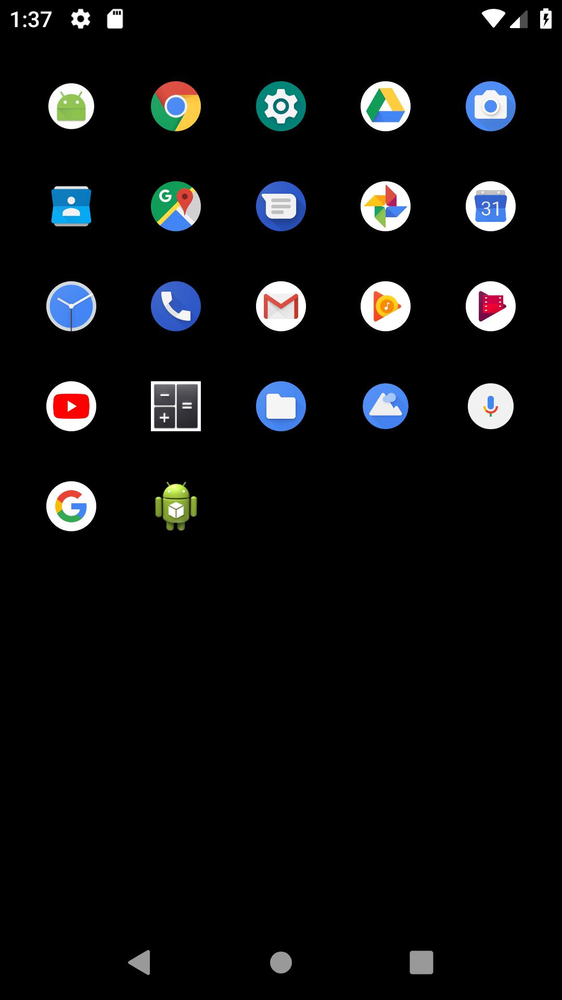

# Lightweight Android Launcher

This is an Android Home Launcher with very light weight process and low cost battery consumption. The main purpose of this launcher to make a very fast launcher, very low consumption of battery, and efficient way to manage application (e.g. kill applciation process, most opened apps, and so on).

 

Launcher set black screen as wallpaper to minimize battery comsumption on AMOLED screen.

| Feature  | Description |
| ------------- | ------------- |
| Tap  | Open app  |
| Long tap  | Open app's setting  |

## Installation

- Clone and open project on Android Studio
- Build APK
- Install app using emulator / your Android Phone

## Contributing

1. Fork it!
2. Create your feature branch: `git checkout -b my-new-feature`
3. Commit your changes: `git commit -am 'Add some feature'`
4. Push to the branch: `git push origin my-new-feature`
5. Submit a pull request :D

## History

- 18 November 2018: Initialization

## Credits

- [riochr17](https://www.github.com/riochr17)
